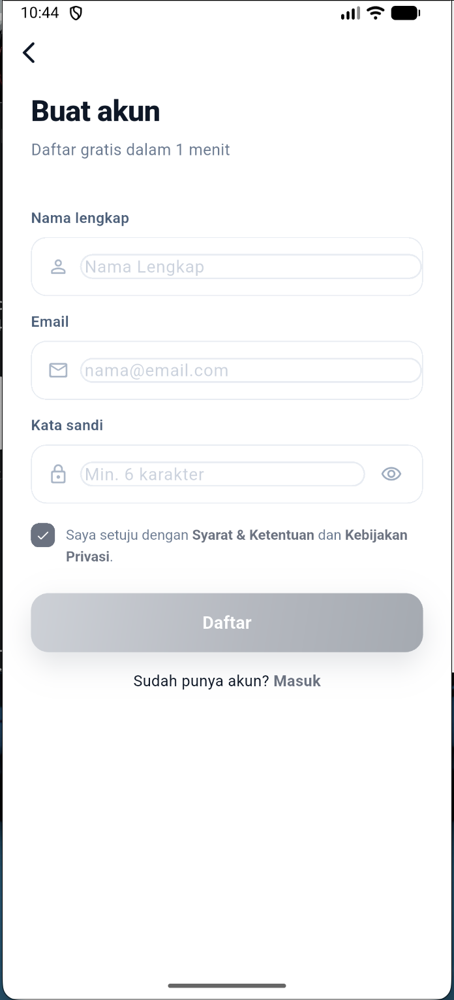
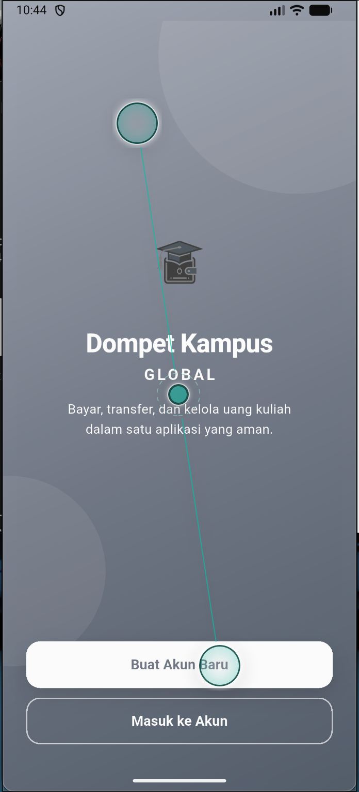
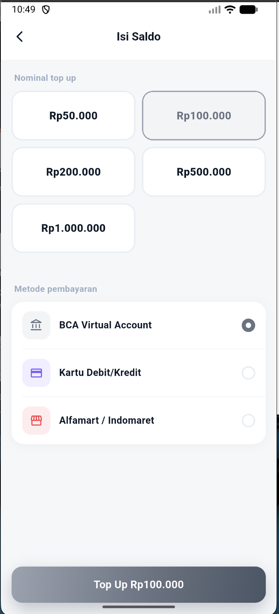
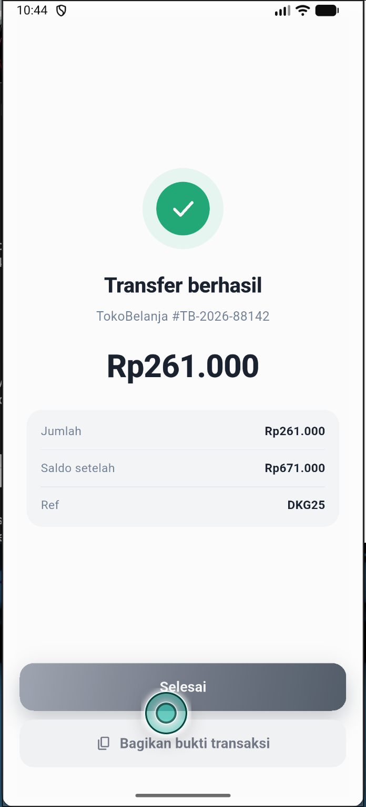
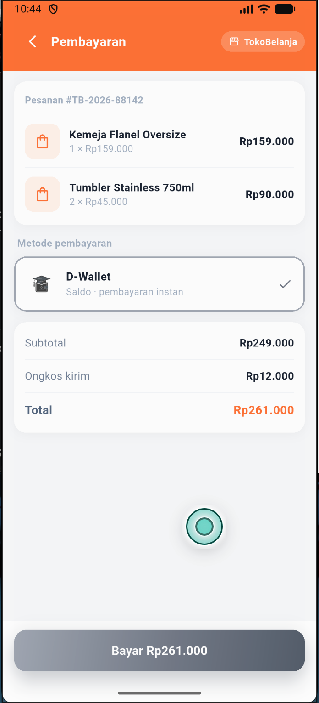
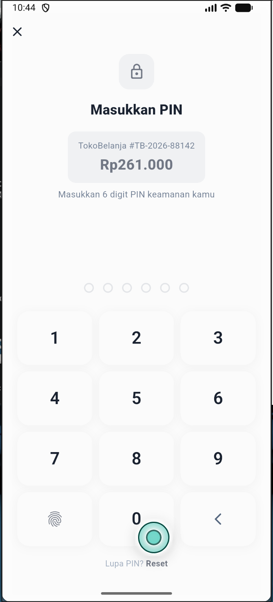

# Dompet Kampus Global (E-Money App)

Dompet Kampus Global adalah aplikasi e-money (dompet digital) yang dirancang untuk memfasilitasi transaksi digital di lingkungan kampus maupun masyarakat umum. Aplikasi ini mendukung fitur *Top Up*, melihat riwayat transaksi (*History*), serta dapat berintegrasi sebagai alat pembayaran (*Payment Gateway*) untuk aplikasi pihak ketiga melalui fitur *Deep Linking*.

## 📸 Hasil Screenshot (Preview)

| Login / Register | Home / Dashboard |
|:---:|:---:|
|  |  |

| Top Up / Transfer | Notif Sukses Payment |
|:---:|:---:|
|  |  |

| Integrasi Pembayaran (Deep Link) | PIN Pembayaran |
|:---:|:---:|
|  |  |

---

## 🔗 Tautan Terkait

- **Repository Marketplace:** [https://github.com/cendyal-hub/marketplace]
- **Video Presentasi (YouTube):** [https://youtu.be/ev57kkgWVkE]

---

## 🛠️ Persyaratan Sistem
Sebelum menjalankan aplikasi, pastikan sistem Anda telah menginstal:
- [Flutter SDK](https://docs.flutter.dev/get-started/install) (Versi terbaru atau yang digunakan pada project ini)
- [Dart SDK](https://dart.dev/get-dart)
- Android Studio / Xcode (untuk emulator atau build ke perangkat fisik)
- VS Code (dengan ekstensi Flutter & Dart) atau Android Studio sebagai IDE

---

## 🚀 Alur Cara Instalasi & Menjalankan Aplikasi

Ikuti langkah-langkah berikut untuk menjalankan aplikasi Dompet Kampus Global di komputer Anda:

### 1. Clone Repository
Buka terminal dan jalankan perintah clone untuk mengunduh kode sumber proyek ini:
```bash
git clone [Masukkan Link Repository Github Dompet Kampus di Sini]
```

### 2. Masuk ke Direktori Proyek
Navigasi ke dalam folder proyek yang baru saja di-clone:
```bash
cd dompet_kampus_global
```

### 3. Unduh Dependencies (Paket)
Jalankan perintah berikut untuk mengunduh semua library dan paket Flutter yang dibutuhkan oleh aplikasi:
```bash
flutter pub get
```

### 4. Menjalankan Aplikasi di Emulator atau Perangkat Fisik
Pastikan emulator (Android/iOS) sudah menyala atau perangkat fisik (HP) sudah terhubung dengan mode *USB Debugging* aktif. Kemudian jalankan:
```bash
flutter run
```

---

## 🏗️ Struktur Arsitektur Singkat
Aplikasi ini dibangun menggunakan arsitektur modular yang terstruktur, dengan state management menggunakan `BLoC`/`Provider` (sesuaikan). Beberapa fitur utamanya antara lain:
- **Autentikasi**: Sistem login dan pendaftaran pengguna.
- **Transaksi**: Fitur *Top Up* untuk menambah saldo dan *Transfer* ke sesama pengguna.
- **Deep Linking**: Memungkinkan aplikasi pihak ketiga (seperti aplikasi Marketplace) untuk memanggil aplikasi ini pada saat proses *Checkout/Payment*.

---
*Dibuat untuk Project Akhir / UAS Pemrograman Mobile.*
